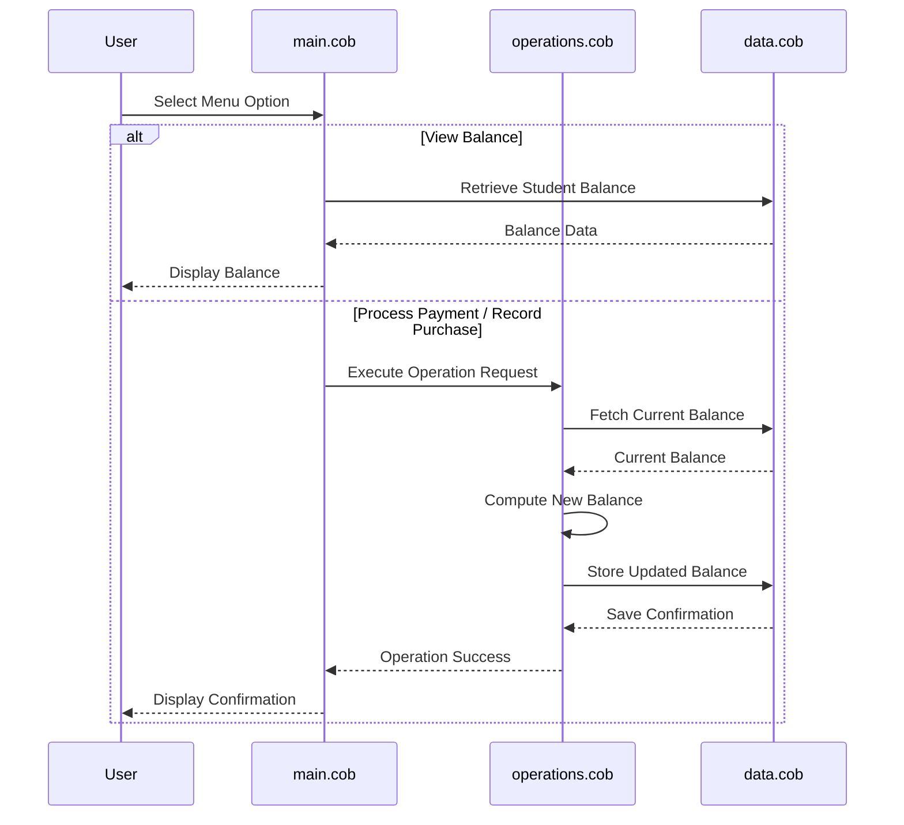

# Legacy Accounting System Documentation

This documentation covers the legacy COBOL-based accounting system used by Mergington High School.

## System Architecture and COBOL Files

- **`main.cob`**: This is the main entry point of the application. It manages the user interface, displays the interactive menu, handles user inputs, and routes actions based on user selection (view balance, process payment, record purchase, or exit).
- **`operations.cob`**: This file contains the core business logic for executing student account operations. It implements the calculations for processing payments (crediting accounts) and recording purchases (debiting accounts).
- **`data.cob`**: This file serves as the data storage manager. It handles retrieving and saving student account balances from the underlying persistent storage.

## Data Flow Diagram

The following sequence diagram illustrates the flow of data within the system during common student account operations:

